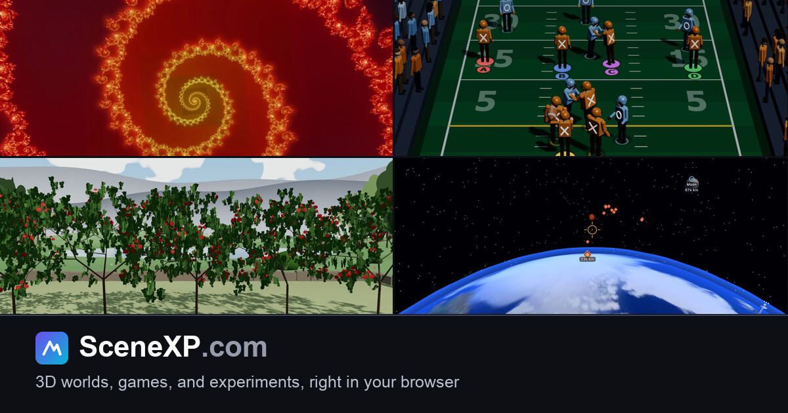
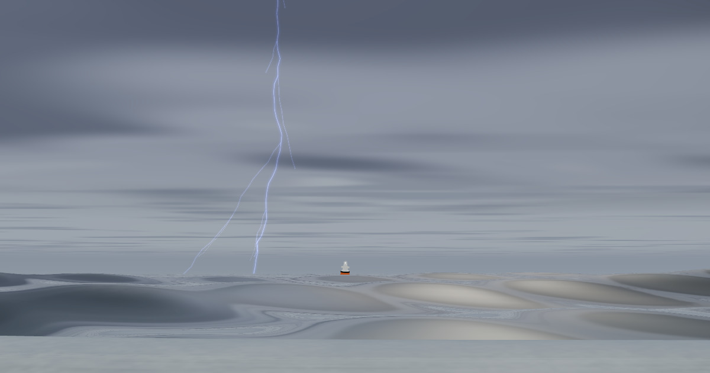
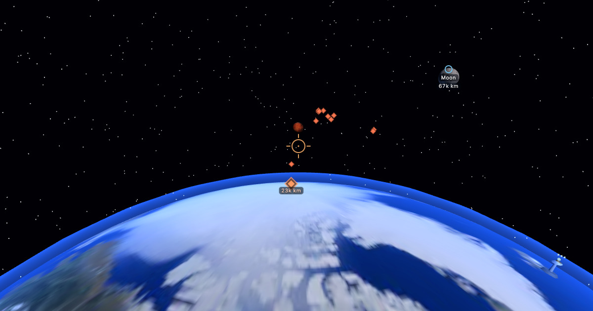

# SceneXP

[](https://github.com/stevendnoll/SceneXP/actions/workflows/ci.yml)

3D worlds, games, and experiments, right in your browser. Built with [Three.js](https://threejs.org/) and nothing else but browser-native HTML, CSS, and JavaScript.

[](https://www.scenexp.com/)

Stand at the water's edge while the weather turns.

[](https://www.scenexp.com/highwater/)

Defend Earth from the Martian fleet.

[](https://www.scenexp.com/earthdefense/)

Try the 3D Mandelbrot zoom.

[](https://www.scenexp.com/mandelbrot/)

[SceneXP.com](https://www.scenexp.com/) is a live website and a home for browser-native 3D experiences: worlds, games, experiments, stories, and simulations. Some were built to honor a person, place, or business. Others exist to show visitors what a browser can do. New experiences land regularly.

Everything runs client side. No app, no download, no account, no cookies, and no third-party scripts, trackers, or CDNs.

The site itself is about three things:

1. Making the hosted 3D experiences easy to discover. Each experience lives in its own `www` subfolder and joins the browseable directory on the home page, the `sitemap.xml`, and the `llms.txt`.
2. Making it easy for developers to contribute their own experiences through GitHub pull requests.
3. Inviting visitors to [reach out](https://www.scenexp.com/contact.html) if they would like an experience built for a person or a business of their own.

SEO is a high priority, as are security, performance, and accessibility.

## Run it locally

No build step. Serve the folder over HTTP (ES modules require `http://`, not `file://`):

```bash
cd SceneXP/www
python3 -m http.server 8000
# then open http://localhost:8000
```
Any static server works (`npx serve`, `php -S`, etc.).

## Minified assets

The pages load the `.min.js` and `.min.css` builds, so rebuild them after editing any JS or CSS:

```bash
npm install
npm run build
```

The build is convention over configuration: `build.mjs` gives every JS and CSS file under `www/` (except the vendored `www/lib/`) a minified sibling, so new files and new experiences are picked up automatically with nothing to wire up.

## Contributing

New experiences and improvements are warmly welcomed. See [CONTRIBUTING.md](CONTRIBUTING.md) for the build steps, the metadata pattern, and how to add your world to the directory, or read the friendlier overview on the site's [contribute page](https://www.scenexp.com/contribute.html). The `main` branch only changes through pull requests, and CI checks every one.

## Visitor data (the snaps folders)

The 3D experiences send anonymized, fire-and-forget usage pings to a static endpoint (`www/api.html`), where they land in the web server's access logs. In production, a separate collector script parses those logs and writes anonymized daily JSON snapshots into each experience's `snaps/` folder, which the in-world visitor dashboards read. The collector and the snapshots are not part of this repository (`snaps/` is git-ignored), so on a fresh clone the dashboards simply have no data to show. That is expected.

## License, credits, and trademarks

© 2026 Continuum Commerce LLC. Released under the MIT license, see [LICENSE](LICENSE). The license covers the custom code written for this project. A few things are **not** covered by it:

- The bundled `www/lib/three.min.js` is by the Three.js Authors and keeps its own MIT license header.
- The Earth Defense planet and moon textures in `www/earthdefense/assets/` are by Solar System Scope, © 2010-2017, and are used under a Creative Commons license rather than ours:

  > Planet and moon textures by Solar System Scope (https://www.solarsystemscope.com/textures), used under CC BY 4.0 (https://creativecommons.org/licenses/by/4.0/). Resized and recompressed for this experience.

  CC BY 4.0 permits commercial use and asks for credit, a link to the license, and a note that changes were made. The wording above is carried verbatim in the experience's pause panel and in [`www/earthdefense/assets/CREDITS.md`](www/earthdefense/assets/CREDITS.md), which also records what the originals were and exactly what we changed. The Mars map's own author describes it as based on NASA elevation and imagery with the saturation raised and the gaps filled with invented terrain, so please do not present it anywhere as a scientific map. Ours is a game and invented terrain is welcome there.
- The Seed to Seed name, logo, and related graphics are trademarks of their owner and appear on the live site as part of a tribute experience, with the owner's kind permission. They may not be reused, redistributed, or modified outside this project.
- The Interstate Tire name, logo, and related graphics are likewise trademarks of their owner, appearing on the live site as part of a tribute experience with the owner's kind permission, and carry the same restrictions.

The logo artwork itself is not included in this repository. The logo files, the Interstate favicon (which is drawn from the logo), and the social preview captures for those three experiences (which show the logos in-scene) are listed in `.gitignore` and never ship. On a fresh clone, those experiences show blank spots where the logos belong and their three cards on the home page have no preview images. Like the empty `snaps/` folders noted above, that is expected. If you fork this repository for your own site, please supply your own artwork in their place.

This project also stands on excellent open source tooling that never ships to the browser but makes the work possible. [esbuild](https://esbuild.github.io/) minifies the assets, and [Jest](https://jestjs.io/) runs the test suite. Both are MIT licensed and arrive via npm with their licenses intact. Our warm thanks to their maintainers, and to the [Three.js](https://threejs.org/) authors most of all.
